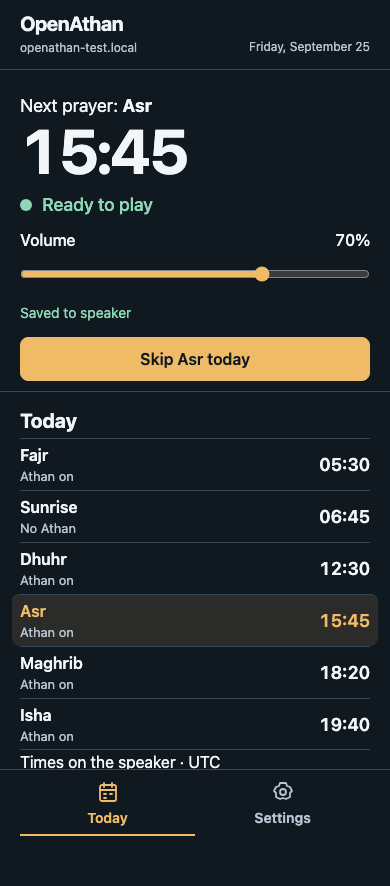
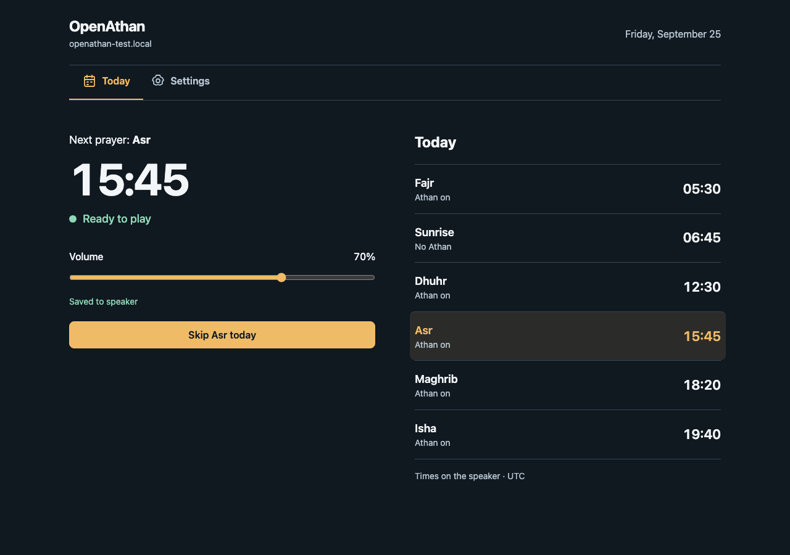
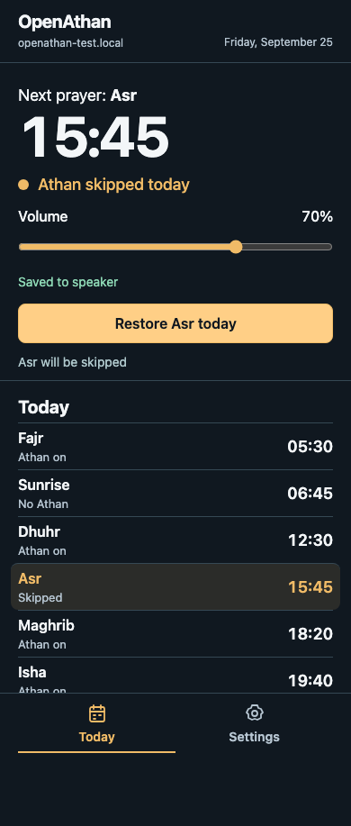
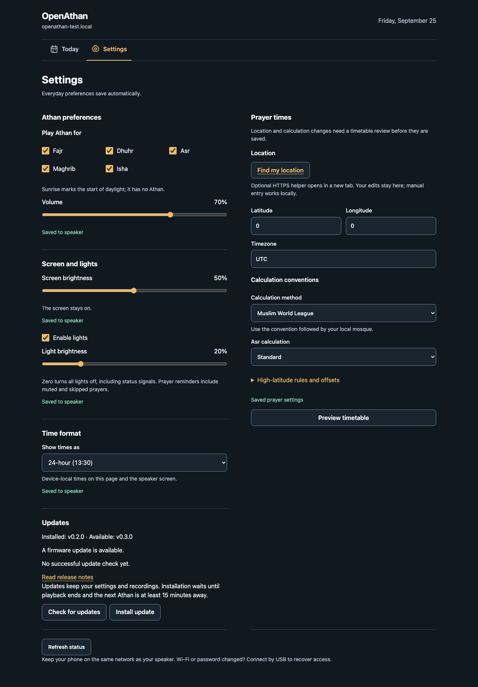
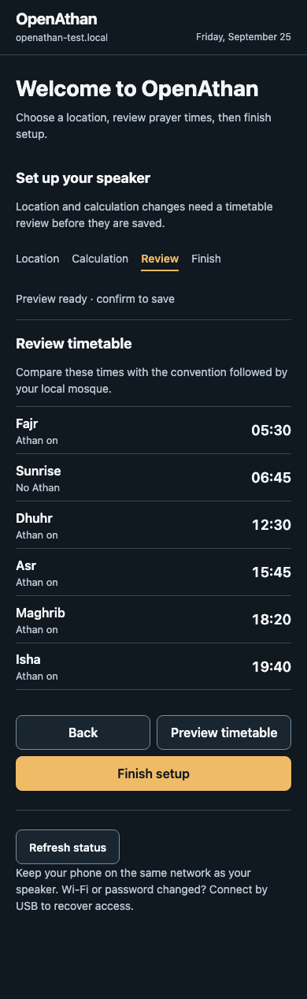

# Device UI redesign validation — 2026-10-05

This report preserves integration and individual review evidence through PR head
`d8b0042bcc882cd662643b46c20840cc0a914b5e`. Its final tables describe that head.
The [2026-10-06 holistic review](device-ui-holistic-review-2026-10-06.md) records
the subsequent controller simplification, current checks and matched OTA sizes.

Unreleased development implementation. The user approved the revised browser
mockups and authorized embedded integration. This report covers production UI
assets, automated host/browser checks and matched compile-only firmware images.
No hardware was accessed, flashed or played; no release or deployment occurred.

## Resulting behavior

Today leads with the authoritative device next occurrence and local time,
readiness, volume and named Skip/Restore. Hero and the single amber timetable row
remain on Asr when skipped; both move only when the reported occurrence changes.
A future-day occurrence has a dated hero and leaves today's rows neutral.
Sunrise has no Athan. Playback identity, history and countdown are not inferred.
A disconnected board freezes observed information and labels it stale; playback
may still be active. Stop is available from both views and remains independent
of preference writes. Successful Stop responses that still report playing keep
pending feedback until authoritative playback completion.

Ordinary preferences save automatically, with immediate slider output and release/
keyboard coalescing. Prayer calculations remain drafts until preview/confirm.
Preference saves merge into the confirmed snapshot, retaining coordinate precision
and excluding unconfirmed calculation changes. Failed/conflicting edits survive;
uncertain outcomes require readback before further writes in their revision domain.
Discarding preference edits does not discard a separate prayer draft. Drafts
survive in-page navigation and warn before browser navigation.

Recovery captures the outstanding edits before starting its readback. Retry,
Use saved values and committed-write verification preserve preferences entered
while that request is pending, including nested toggles and edits returning to
the same value. Released changes save with the confirmed revision; unreleased
slider input waits for release and remains labeled unsaved. Use saved values
also retains a prayer draft changed during readback for fresh preview/confirmation.
Focused sliders now follow confirmed values while idle, so a keyboard adjustment
uses the latest value. Ongoing drags retain their edited value across polling.

Review corrections on 2026-10-06 invalidate ready previews when conflict recovery
reads changed calculation settings, before replacing the confirmed snapshot.
Delayed Skip/Restore responses and uncertain-action readbacks preserve playback
confirmed by a newer Stop. Successful status responses without settings, when
storage is explicitly faulty, remain connected and show the device fault.
Prayer controls and confirmation are disabled; drafts and pending edits survive,
with independent preferences and reported playback Stop still available. Recovery
requires confirmed saved settings, and no default prayer settings are invented.

A subsequent review on 2026-10-06 corrects queued confirmation cancellation and
response order in the opposite direction. Discard removes an unsent prayer patch
while retaining automatic preference patches, and invalidates an in-flight
preview. Once a prayer request is sent, Discard waits for confirmation or an
explicit recovery choice.
Delayed Stop replies and readbacks preserve newer prayer-action and playback
observations; older complete snapshots cannot regress independently saved
preferences or firmware-check results. A newer playback observation remains
stoppable rather than being hidden by an earlier Stop reply. An older Stop
snapshot cannot confirm a newer Skip request whose response was lost; Skip stays
disabled and visibly unconfirmed until fresh authoritative state arrives.

Further review corrections on 2026-10-06 keep a Skip queued behind conflicted or
faulty prayer settings from blocking healthy independent saves. Optional storage
faults are accepted even with revision zero or missing light settings, retaining
last confirmed values and pending edits. Their controls and recovery actions are
disabled until valid saved state is available; unreadable stores without confirmed
values show unknown values rather than fallback preferences. The last confirmed
time format is retained during a fault. An older successful save response cannot clear a
newer fault or discard edits; it requires fresh saved-state readback.

The prayer-settings domain now also preserves a newer storage fault reported by
Stop when an older healthy save reply, save readback or Skip response arrives.
Stale save confirmations require fresh readback and cannot acknowledge pending
preferences or a reviewed prayer draft. Rejected stale readback retains the draft
and queued patch without reporting connection loss. Fresh recovery confirms an
already committed write without sending it again.

Older complete responses at the same prayer-settings revision now retain newer
operational observations: occurrence, Skip state, timetable, device date, clock
and readiness. Delayed Skip/Restore replies and readbacks cannot return the hero
or highlight to Asr after a newer Stop response advances to Maghrib. Completion
feedback follows accepted state and asks the user to review the current prayer
when the target occurrence changed. A settings acknowledgment still confirms its
saved preferences without regressing a newer timetable or date.
Stale screen/light/time-format save and recovery readbacks retain connection
state; they keep active Stop available while preserving edits and requiring fresh
saved-state recovery. Actual request/read failures retain the existing recovery.

Save acknowledgments now check the known revision and response order before
replacing or acknowledging data in any of the four settings domains. Older
healthy replies/readbacks retain newer confirmed preferences and application
feedback, not only storage faults. Fresh readback reconciles the outcome before
another write; conflicting revisions retain edits for Retry or Use saved values.
Displayed prayer times use the confirmed format while a format edit is unresolved.
New calculation observations invalidate an old preview during an in-flight
preference save, retaining the prayer draft. A stale prayer confirmation cannot
discard that draft or bypass fresh preview/confirmation after another client's edit.

First run follows location → calculation → timetable review → Finish setup.
The optional HTTPS helper precedes manual coordinates. Helper proposals require
ready preview; manual setup can finish while waiting for valid time with a warning.
Storage recovery into incomplete configuration now opens the setup view when it
was hidden, with focus on the visible main content. Fresh revision-one recovery
uses the same required location fields as initial setup; existing drafts survive.
Repeated incomplete-state polls preserve setup focus and feedback, and recovery
into active configuration retains the current view.
Settings expose screen/lights only when supported and retain independent display,
lights and time-format persistence. Existing request payloads/revisions are retained.
The only additive API field is read-only `local_date` on valid-clock status,
derived from saved timezone and omitted while waiting; clients tolerate absence.

## Automated checks

- **316 Chromium/WebKit checks passed, zero failures or skips.** They exercise the real production HTML/CSS/JavaScript and C++
  Digest verifier against simulated settings endpoints. The final suite covers
  automatic saves, rapid/nested edits, domain conflicts, dropped committed replies,
  failed readback, applying/storage/output failures, Stop during saves and delayed
  Stop completion, occurrence-bound Skip and uncertain action reconciliation,
  draft retention, location handoff, stale previews, setup clock gates, capability
  visibility, coordinate precision, device-local time, update regressions and nonce
  expiry without a second Chromium sign-in prompt.
- The 20 added review regression checks cover preference conflict Retry/Use saved
  values with a ready prayer preview, delayed Skip/Restore responses and readbacks
  after Stop, initial unreadable prayer storage, fault/recovery draft retention,
  uncertain save readback during a storage fault and a preview arriving during
  that fault. Independent time-format saves and Stop remain usable where the
  authoritative device state allows them. Unchanged storage-fault polls do not
  mutate the live feedback text; preview-arrival checks await the response body
  and browser rendering rather than a fixed delay.
- A further 38 review regression checks cover queued prayer cancellation with and
  without automatic preference edits, sent/unconfirmed writes, discarded pending
  previews, delayed Stop replies/readbacks after Skip/Restore, all four persistence
  domains and firmware-check results. Both orders of older preference and newer
  Stop replies are checked, along with a later authoritative playback observation.
  Screen/light application status remains current even when a newer confirmed
  response has the same preference revision. Older Stop replies cannot clear a
  newer uncertain Skip outcome; fresh readback confirms it before another action.
- Another 24 review regression checks cover queued Skip behind both prayer-domain
  conflicts and storage faults while display, lights and time format keep saving;
  the original queued action remains unsent until recovery. Optional storage
  faults are checked at initial load, after confirmed load, during uncertain-save
  readback and during a save whose success response arrives late. Confirmed values,
  pending edits, quiet feedback, independent controls and Stop are preserved;
  recovery remains gated by fresh valid saved state. An older Stop fault snapshot
  cannot replace newer healthy preferences. Conversely, older complete settings
  replies cannot clear newer optional storage faults.
- Ten additional regression checks reproduce delayed prayer-save replies with
  retained or unreadable saved settings, lost replies followed by delayed healthy
  readback for both preference and reviewed calculation writes, and a delayed Skip
  after newer Stop/storage observations. All ten failed before the correction and
  passed afterward in Chromium/WebKit. Edits and storage feedback remain present,
  healthy time-format saves continue, and recovery confirms the committed values
  without another prayer-settings write.
- A further 26 regression checks cover Skip/Restore replies and readbacks after
  the next occurrence advances, updated clock/volume readiness, and a preference
  acknowledgment after a newer day's timetable arrives. All three optional stores
  are checked during both uncertain-save readback and explicit recovery while
  playback remains active. Neither transient nor terminal connection-loss feedback
  appears for stale data; independent saves continue, fresh recovery confirms the
  committed preferences without another write, and Stop remains usable. The
  reviewed-head fixtures reproduced both defects before the corrections.
- Another 32 regression checks cover stale healthy replies and readbacks in all
  four revision domains, Retry/Use saved values and expected revisions, same-revision
  screen/light application feedback, and explicit format recovery without a
  transient obsolete time format. Prayer drafts and coordinate precision survive
  automatic preference recovery; a conflicted reviewed prayer edit requires fresh
  preview/confirmation before writing. All 32 failed on the reviewed head and
  passed after the corrections in Chromium/WebKit. Stop and connected state remain
  available, and stale acknowledgments cannot clear the pending edits.
- Another 24 regression checks follow native sequential keyboard navigation
  through Settings at 320px, 390px and 1280px, with ordinary/200% text and optional
  hardware present/absent. All 24 reproduced the reviewed-head jump from Volume
  to hardware/time format instead of Prayer times, then passed with markup in the
  phone section order. Desktop grid placement preserves the columns and adjacent
  left-hand groups. The checks also verify that first run hides preference/update
  controls and that they return when setup becomes active.
- Another 10 regression checks exercise the actual five-second status polling
  timer for initial storage recovery into incomplete/active configuration and
  later faults with drafts in Today or Settings. The manual recovery reproducer
  failed on the reviewed head in both browsers; it now opens and completes setup.
  Helper proposals remain gated on ready preview, manual completion still permits
  waiting for a valid clock, and activation writes use the confirmed revision.
  Drafts, visible Stop and existing Settings focus survive; repeated polls neither
  redirect the setup view nor change its live feedback. All ten pass in Chromium/WebKit.
- Another 56 checks cover edits during Retry, Use saved values and committed-write
  recovery in all four revision domains, including nested toggles, exact coordinate
  precision, same-value edits, unreleased sliders and a prayer draft edited during
  recovery. Coalesced keyboard edits pending before recovery are resolved with
  the original edits; their timers cannot reapply discarded values or submit a
  newer unreleased drag. Native pointer drags and focused keyboard adjustments are checked for
  both volume controls, screen brightness and light brightness across the actual
  five-second polling timer. Both reported reproducers failed on the reviewed head
  in Chromium/WebKit before the correction. New edits remain separate from the
  recovery decision, and no unsaved drag is reported saved or sent before release.
- Layout checks: 320px, 390px and 1280px, ordinary and 200% root text, both time formats and system/wider native fonts;
  Today and Settings have no horizontal overflow. Linux CI exposed wide-font
  time and native dropdown overflow. The corrected hero scale and bounded native
  fields retain the approved composition and a visible outer focus ring. Buttons/ranges/selects meet 44px dimensions;
  checkbox labels provide 48px targets. Native Chromium Tab and macOS Safari
  Option-Tab traversal are checked. Text pairs meet 4.5:1 and control boundaries
  3:1; unchanged status polls do not mutate the readiness live text.
- 103 Python tests passed with no skipped tests. Production and isolated settings
  adapters compile the actual local API with pinned ArduinoJson; coverage adds
  valid local date, timezone date rollover and invalid-clock omission.
- All 16 CTest tests passed with undefined-behavior sanitization.
- All nine developer ESPHome configurations validated. Affected reference,
  isolated, qualification and rollback variants compiled and passed the existing
  capacity/dependency/partition/audio-exclusion checks before and after.
- JavaScript syntax and Git whitespace checks passed.

Browser endpoint fixtures and all figures below are **simulated data**. They do
not establish physical audio, screen/light behavior or actual assistive-technology
speech. Tests inspect DOM semantics and announcements; VoiceOver/NVDA speech is
unmeasured.

## Matched OTA measurements

Baseline commit: `16fd942951361955fbb047e1bdfd2a3668580f62`.
Both phases used the same disposable source/build directories, public compile-only
settings, generated synthetic audio fixture, Python 3.13.0, ESPHome 2026.9.0,
ESP-IDF 5.5.5 and `esp-14.2.0_20260121`, with the existing reviewed dependency pins.
Only the intended UI assets and local API source were copied into the candidate.
Actual OTA images were measured; linked-image estimates were not substituted.

Application budget: **1,572,864 bytes**. Each slot remains **2,097,152 bytes**,
with both slots and the separate 3.5 MiB shared audio partition unchanged.

| Variant | Before OTA bytes | After OTA bytes | Delta | Budget remaining |
| --- | ---: | ---: | ---: | ---: |
| reference | 1,256,144 | 1,263,520 | +7,376 | 309,344 |
| isolated | 1,257,904 | 1,265,296 | +7,392 | 307,568 |
| qualification | 1,263,280 | 1,270,688 | +7,408 | 302,176 |
| rollback | 1,263,280 | 1,270,688 | +7,408 | 302,176 |

Reference slot free space is 833,632 bytes;
the largest affected image leaves 826,464
bytes. All exceed the required 512 KiB slot headroom. Capacity checks verified
factory/OTA payload equality, reviewed dependencies, unchanged partitions,
qualification/test-material isolation and absence of audio recordings in apps.
Every final OTA contains the exact current gzip bytes of all three UI assets.

| Asset | Before gzip bytes | After gzip bytes | Delta |
| --- | ---: | ---: | ---: |
| `index.html` | 2,553 | 3,392 | +839 |
| `app.js` | 8,048 | 13,090 | +5,042 |
| `style.css` | 1,524 | 2,963 | +1,439 |

Total compressed UI assets grow from 12,125
to 19,445 bytes. No frontend framework, font,
image, remote asset or new runtime dependency is bundled. npm remains test tooling.

| Variant | Before OTA SHA-256 | After OTA SHA-256 |
| --- | --- | --- |
| reference | `8af88f13d1ff410315a0dd182470fa7bf3817ba0741977d2cb37696372b1d1e3` | `5e0e77ab1ccf82813714cd5e8d058da00153120f037a1264a92af84fe29258cd` |
| isolated | `988a71a075bad4b2780134cdda81676d4d8fda8a4ca0e2e18c2c330314dd7a4e` | `ef234e67a6cac4872982c77a7c7cedd88a6bea251777b7bf5952b7965554800b` |
| qualification | `685500c1b2911c00daa6bf2042aebf9b8e4d509a44a90fd327755872f5e3a699` | `da796b329891f1580f4b73de1ef8ac50e9ad95de35806d666fcc561bbf87b813` |
| rollback | `39b85947a3e86e2b553d1f46bbe998a82df5f17423e552563fdfca59091d38bc` | `2678f1d34378e48610063069a934c3409ab90f67fce9fc8acedf49eacfb9a639` |

The 2026-10-06 review fixes were also measured against reviewed PR head
`d6d3a1054c894cd8f1bb9e2e7bb6833a0d339313`, using those same pinned
directories and configurations, with prior images/logs archived before rebuilding.

| Variant | Reviewed OTA bytes | Corrected OTA bytes | Review-fix delta |
| --- | ---: | ---: | ---: |
| reference | 1,262,128 | 1,262,464 | +336 |
| isolated | 1,263,904 | 1,264,240 | +336 |
| qualification | 1,269,280 | 1,269,616 | +336 |
| rollback | 1,269,280 | 1,269,616 | +336 |

These UI-only corrections leave static RAM unchanged and add no device request
polling or runtime dependencies. All four capacity checks pass.

The subsequent cancellation/Stop-order corrections use reviewed head
`6a3ac40608bc33210894f0696ab1016f2275180e` as a further matched baseline.
Its images and logs were retained before replacing the same candidate source.

| Variant | Reviewed OTA bytes | Corrected OTA bytes | Subsequent review delta |
| --- | ---: | ---: | ---: |
| reference | 1,262,464 | 1,262,976 | +512 |
| isolated | 1,264,240 | 1,264,752 | +512 |
| qualification | 1,269,616 | 1,270,144 | +528 |
| rollback | 1,269,616 | 1,270,144 | +528 |

All four capacity checks passed with the then-current gzip assets. Request-order
metadata and cancellation tracking are browser-only state;
they add no polling or device runtime dependencies. Static RAM remains unchanged.

The independent-save/optional-storage corrections use reviewed head
`b713ee3654d6d1347ca84b2539704b5245eafbe4` as the matched baseline.
Those exact images and logs were archived before updating the candidate.

| Variant | Reviewed OTA bytes | Corrected OTA bytes | Latest review delta |
| --- | ---: | ---: | ---: |
| reference | 1,262,976 | 1,263,152 | +176 |
| isolated | 1,264,752 | 1,264,928 | +176 |
| qualification | 1,270,144 | 1,270,304 | +160 |
| rollback | 1,270,144 | 1,270,304 | +160 |

All four capacity checks passed with the then-current gzip assets;
static RAM, partitions, dependencies and polling cadence were unchanged.
The additional fault/recovery state remains bounded browser state.

The prayer-storage response-order correction uses reviewed head
`28d8c5eb67e9696fe76b3a1b635106778d06ca61` as its matched baseline.
Its exact images, measurements and logs were archived before rebuilding the same
configurations with the corrected assets.

| Variant | Reviewed OTA bytes | Corrected OTA bytes | Prayer-storage review delta |
| --- | ---: | ---: | ---: |
| reference | 1,263,152 | 1,263,216 | +64 |
| isolated | 1,264,928 | 1,264,992 | +64 |
| qualification | 1,270,304 | 1,270,368 | +64 |
| rollback | 1,270,304 | 1,270,368 | +64 |

All four capacity checks passed with the then-current gzip assets.
At least 302,496 bytes remained under the application budget.
Static RAM, partitions, dependencies and polling cadence are unchanged.

The occurrence/readback corrections use reviewed head
`e80ed6acc145d6b3908919d6b19445aaedf1564c` as their matched baseline.
Exact images, measurements and logs were retained before rebuilding the same
pinned configurations with the corrected UI.

| Variant | Reviewed OTA bytes | Corrected OTA bytes | Occurrence/readback review delta |
| --- | ---: | ---: | ---: |
| reference | 1,263,216 | 1,263,280 | +64 |
| isolated | 1,264,992 | 1,265,056 | +64 |
| qualification | 1,270,368 | 1,270,448 | +80 |
| rollback | 1,270,368 | 1,270,448 | +80 |

All four capacity checks passed with the then-current gzip assets.
At least 302,416 bytes remained under the application budget.
Static RAM, partitions, dependencies and polling cadence remain unchanged; the
response-order state is bounded browser state.

The healthy-acknowledgment corrections use reviewed head
`50d620f58193b5b27937ded6edafb7a64125c2a9` as their matched baseline.
Exact images, measurements and logs were archived before compiling the corrected
assets in the same pinned configurations.

| Variant | Reviewed OTA bytes | Corrected OTA bytes | Healthy-acknowledgment review delta |
| --- | ---: | ---: | ---: |
| reference | 1,263,280 | 1,263,376 | +96 |
| isolated | 1,265,056 | 1,265,168 | +112 |
| qualification | 1,270,448 | 1,270,544 | +96 |
| rollback | 1,270,448 | 1,270,544 | +96 |

All four capacity checks passed with the then-current gzip assets, leaving at
least 302,320 bytes under the application budget. Static RAM, partitions,
dependencies and polling cadence remained unchanged. The guard reuses the existing
uncertain-save readback/recovery flow.

The Settings keyboard-order correction uses reviewed head
`e09f2f65a5e69b1ca0113008f251ab130dbdda50` as its matched baseline. Exact
images, measurements and logs were archived before compiling the corrected
markup/CSS/JavaScript in the same pinned configurations.

| Variant | Reviewed OTA bytes | Corrected OTA bytes | Keyboard-order review delta |
| --- | ---: | ---: | ---: |
| reference | 1,263,376 | 1,263,360 | -16 |
| isolated | 1,265,168 | 1,265,152 | -16 |
| qualification | 1,270,544 | 1,270,528 | -16 |
| rollback | 1,270,544 | 1,270,528 | -16 |

All four capacity checks passed with the then-current gzip assets, leaving at
least 302,336 bytes under the application budget. Static RAM, partitions,
dependencies and polling cadence remained unchanged. The runtime change was
limited to browser markup/grid placement and first-run visibility; physical
playback and runtime memory were not measured.

The incomplete-setup recovery correction uses reviewed head
`a033511944172d11c208a8b0543866079f722c87` as its matched baseline. Exact
images, measurements and logs were archived before compiling the corrected
JavaScript in the same pinned configurations.

| Variant | Reviewed OTA bytes | Corrected OTA bytes | Setup-recovery review delta |
| --- | ---: | ---: | ---: |
| reference | 1,263,360 | 1,263,376 | +16 |
| isolated | 1,265,152 | 1,265,168 | +16 |
| qualification | 1,270,528 | 1,270,544 | +16 |
| rollback | 1,270,528 | 1,270,544 | +16 |

All four setup-recovery capacity checks passed. Each OTA contained the exact gzip
assets for that change, and at least 302,320 bytes remained under the application budget.
Static RAM, partitions, dependencies and polling cadence remain unchanged.
That runtime change was limited to browser view selection and draft initialization;
physical playback and runtime memory were not measured.

The recovery/edit and focused-slider correction was also measured against
reviewed head `d12192570d07a9455948019c2485eaf9f08c8646`, using the same pinned
configurations. Its verified OTA images and logs were archived before rebuilding.

| Variant | Reviewed OTA bytes | Corrected OTA bytes | Recovery/edit review delta |
| --- | ---: | ---: | ---: |
| reference | 1,263,376 | 1,263,520 | +144 |
| isolated | 1,265,168 | 1,265,296 | +128 |
| qualification | 1,270,544 | 1,270,688 | +144 |
| rollback | 1,270,544 | 1,270,688 | +144 |

All four current capacity checks pass with exact final gzip assets in every OTA.
At least 302,176 bytes remain under the application budget. Static RAM, partitions,
dependencies and polling cadence remain unchanged. The extra recovery state is
bounded to the preference fields and lives in the browser; no device runtime
heap, fragmentation, PSRAM or physical playback measurements were performed.

Use the pinned environment and prepared public CI fixture for reproduction:

```sh
python tools/prepare_ci.py --output-dir /tmp/openathan-ui-audio
# For each phase, set a matching build path, then compile the configuration.
ESPHOME_BUILD_PATH=/tmp/openathan-ui-reference python -m esphome compile firmware/esphome/openathan.yaml > /tmp/reference.log 2>&1
python tools/check_feasibility.py --build-dir /tmp/openathan-ui-reference/openathan --log /tmp/reference.log --audio-image /tmp/openathan-ui-audio/athan-audio.bin
```

Repeat with `provisioning/validation.yaml` (`openathan-test`),
`upgrades/qualification.yaml` (`openathan-test`), and that qualification config
with `-s qualification_version v0.0.3 -s qualification_startup_failure true`.
Archive baseline logs/images before replacing source with candidate assets.
See the CI README for full prerequisites and configuration checks.

## Runtime assessment

Static RAM is unchanged: 115,219 bytes for reference/isolated and 115,291 for
qualification/rollback. The UI is gzip data served from flash; its extra browser
state lives in the client. Status adds one bounded device-local date string.
Existing 5-second status and 3-second update polling cadences are retained, with
hidden-tab polling suppressed and unchanged text/timetable updates coalesced.
Preference writes are serialized and slider keyboard changes debounced; Stop
retains an independent request path. These changes do not add an unbounded queue.

Static RAM and successful compilation do **not** establish heap, fragmentation,
PSRAM, concurrent audio/network headroom or device response latency. Those remain
unmeasured for this revision; no physical runtime acceptance is claimed.

## Visual review and representative captures

The fresh Impeccable review found the supplied production composition faithful to
the approved browser direction and no material visual defect. It requested one
truthful Stop-feedback correction. Its verdict pass scored that one fix Resolved
and returned `ship` at the listed-fix scope. Documentation records the production
translation while preserving the historical generated-comp pixel gate as open.
No exact pixel reproduction or release readiness is implied.

All figures use **simulated API data** from the real production-asset test harness.
Full-page phone captures retain fixed navigation at the original viewport bottom;
content below that viewport remains reachable by scrolling.






