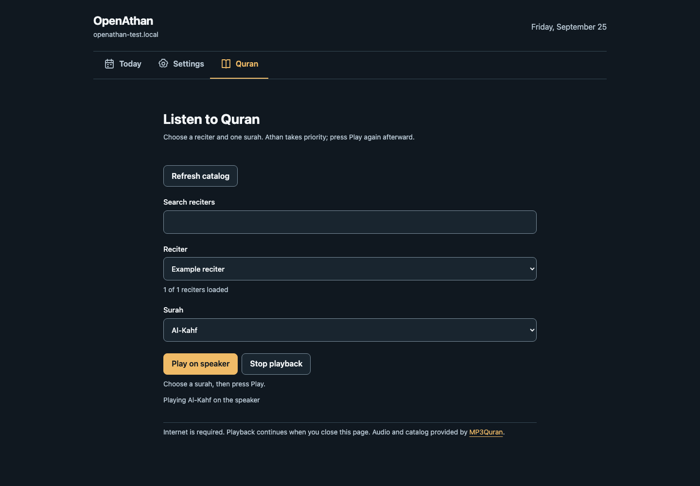
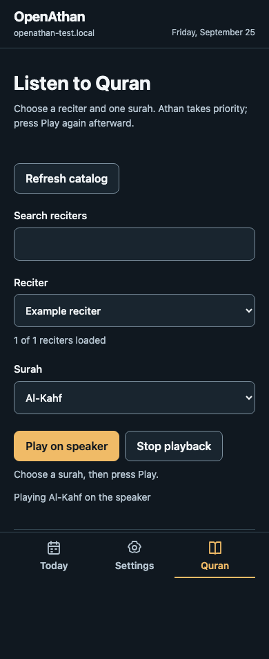

# Quran streaming implementation validation — 2026-10-10

MP3Quran single-surah streaming is a development implementation. Automated checks
cover metadata resolution, cancellation, Athan priority and local controls.
Physical streaming, audible output and concurrent runtime memory remain
unqualified. This report does not establish release readiness.

## Source and validation scope

The comparison baseline is main `e4304465de98c925c34820b945b2549854a4bd63`.
Candidate firmware and embedded UI match `16d7da50436dc294d8d23dc975edc6f9a875460d`.
Both use ESPHome 2026.9.0, Python 3.13, tzdata 2026.4 and ESP-IDF 5.5.5,
the same configuration and public compile-only settings. Generated shared-audio
fixtures are synthetic, outside application images and unsuitable for playback
or installation. No hardware was accessed for these results.

See [CI reproduction](../../.github/workflows/README.md),
[browser prerequisites](../../web/device-ui/README.md#browser-validation) and
the [streaming contract](quran-streaming.md).

| Check | Result |
| --- | --- |
| CMake/CTest host suite under UBSan | 18/18 passed, including audio, scheduler, display, Waveshare and RTC adapters. |
| Python suite with pinned ESPHome and resolved ArduinoJson | 113/113 passed; production and isolated local API routing preserve durable records. |
| Complete browser suites | Chromium 247/247 and WebKit 247/247 passed with the production Digest bridge. |
| Final Quran browser cases | 8/8 passed across both browsers, including two additional uncertain-Play/Settings-Stop cases. |
| Existing Stop browser cases | 100/100 passed across Chromium and WebKit after the final loading-state change. |
| Production Quran worker and HTTPS helper under UBSan | Passed deterministic HTTP/task checks. |
| Pinned ESPHome mirror verification | Only the two documented upstream source files differ; all other manifest hashes match. |

The complete browser suites cover existing preferences, drafts, recovery,
authentication and response ordering. Focused final checks cover catalog retry,
edition availability, distinct catalog/playback feedback, playback completion,
uncertain Play without repetition and Stop during loading from Settings. An
initial mixed-source full run had a WebKit playback-observation timeout; both
complete suites passed against stable rebased source, followed by final affected
checks. Simulated responses do not establish device network or speaker behavior.

The worker tests use production `quran.cpp` and the shared HTTP policy. They
cover whole-catalog search and paging, all 114 surah names, malformed/truncated
objects, object-size limits, unavailable surahs, task allocation failure, Stop,
Athan, disconnect, speaker failure, maintenance and shutdown cancellation.
Catalog browsing leaves active audio untouched. Redirect tests reject insecure
or foreign destinations before connecting and verify detached callback lifetime.
The audio adapter checks decoder failure, request timeout and epoch revocation.
These tests use deterministic adapters, without real TLS or a physical decoder.

## OTA capacity

All ten variants are compared using actual `firmware.ota.bin` payloads and the
capacity checker. The 1,572,864-byte application budget, dual 2,097,152-byte slots
and separate 3,670,016-byte shared-audio partition are retained. Generic scheduler
profiles have no Quran metadata service or product network-reader patch.

| Variant | Baseline OTA bytes | Candidate OTA bytes | Delta | Budget remaining | Slot free | Static RAM bytes (delta) |
| --- | ---: | ---: | ---: | ---: | ---: | ---: |
| Atom reference | 1,277,360 | 1,298,640 | +21,280 | 274,224 | 798,512 | 115,619 (+152) |
| Waveshare production | 1,284,752 | 1,306,640 | +21,888 | 266,224 | 790,512 | 116,115 (+152) |
| Scheduler device | 1,121,168 | 1,121,520 | +352 | 451,344 | 975,632 | 113,231 (+16) |
| Scheduler validation | 1,138,704 | 1,139,056 | +352 | 433,808 | 958,096 | 113,943 (+16) |
| Provisioning validation | 1,278,800 | 1,300,096 | +21,296 | 272,768 | 797,056 | 115,619 (+152) |
| Upgrade qualification | 1,284,336 | 1,304,912 | +20,576 | 267,952 | 792,240 | 115,699 (+160) |
| Upgrade startup failure | 1,284,336 | 1,304,912 | +20,576 | 267,952 | 792,240 | 115,699 (+160) |
| Waveshare audio | 1,213,344 | 1,235,296 | +21,952 | 337,568 | 861,856 | 113,699 (+160) |
| Waveshare display | 1,263,312 | 1,285,024 | +21,712 | 287,840 | 812,128 | 116,115 (+152) |
| Waveshare diagnostics | 1,350,224 | 1,371,888 | +21,664 | 200,976 | 725,264 | 116,783 (+160) |

A task-local disk-space failure occurred after the display OTA was generated,
before the ELF copy completed. Generated intermediates were cleared, the compile
was rerun successfully and its capacity result above uses the successful run.

Static RAM from the linker is a separate measurement. It does not establish
available heap, fragmentation, PSRAM, TLS headroom or task-stack margin. The
8 KiB metadata task and bounded JSON allocations need concurrent hardware
measurement before release. There is no added UI framework, font service or
bundled Quran recording. Embedded gzip assets total 25,104 bytes versus 22,015
bytes on the baseline, an increase of 3,089 bytes. All 150 tracked binary-producing
firmware, UI and core files in the candidate build tree match the reviewed source.

## Provider observations

The live English reciter response contained 243 entries in 161,432 bytes; the
largest raw entry was 5,329 bytes, below the 16 KiB object limit. Its observed
audio hosts were `cdn.mp3quran.net` and `server15.mp3quran.net`. These are dated
provider observations, not a fixed catalog count or a guarantee of future hosts.

Bounded byte-range downloads, without playing or bundling media, returned
`audio/mpeg` over certificate-verified HTTPS. FFprobe identified these formats:

| Requested recording | Observed format and redirect |
| --- | --- |
| Ibrahim Al-Akhdar, surah 1 | MP3, 22,050 Hz stereo, 48 kbit/s; no redirect. |
| Alhusayni Al-Azazi, surah 1 | Provider redirected to Muhammad Minshawi's `r3/001.mp3` on the same approved CDN; MP3, 44,100 Hz stereo, 128 kbit/s. |
| Othman Al-Ansary, surah 1 | MP3, 44,100 Hz stereo, 256 kbit/s; no redirect. |

These range requests returned HTTP 206; the production reader requests a complete
recording and requires HTTP 200. They establish provider reachability, sample
formats and an observed redirect, without proving the device's TLS, decode,
mono output, clock handling or long-stream behavior. The pinned decoder supports
16-bit PCM with one or two channels and supplies decoded stream information to
the existing I2S speaker; actual output across these formats remains untested.

## UI evidence

Chromium captures use a synthetic reciter, catalog and playback state at 1440 px
desktop and 390 px phone widths. They show interface layout and feedback only.
The existing palette, native controls and local asset design remain intact.
Review fixes separately resolved stale playback feedback, catalog errors hidden
during playback, and Settings Stop hidden during loading.

The loading-state Stop bar is visible in both
[desktop](quran-streaming/settings-loading-desktop.png) and
[phone](quran-streaming/settings-loading-mobile.png) captures.

## Remaining qualification

Before release, follow the [attended hardware qualification list](quran-streaming.md#hardware-qualification-before-release).
Measure long-surah and repeated-start memory behavior while streaming, parsing
catalogs, polling the local UI and updating optional displays. Verify audible
formats, physical Stop, due Athan priority, Wi-Fi stalls/loss, cold restart and
firmware-maintenance interruption. Confirm preserved prayer settings, consumption
history, shared recordings and recovery. Existing Athan hardware evidence does
not qualify this new Quran path.
