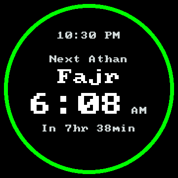
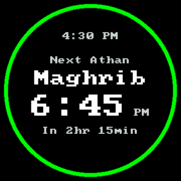
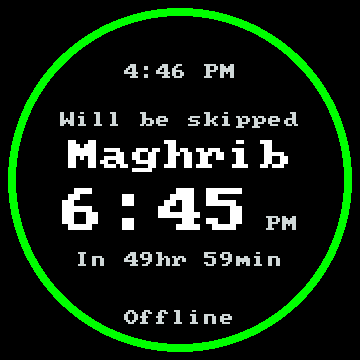

# Waveshare countdown validation — 2026-10-09

This implements the user-approved [Ring + countdown surface](../../.impeccable/surfaces/firmware-esphome-components-openathan-display-render-h.md)
at unreleased development scope. The later wording decision removes spaces
between numbers and units: `In 2hr 15min`, `In 1hr`, `In 8min`, `In <1min`.
The first attended application installation, saved-state checks and owner
readability confirmation passed on one Waveshare V2 unit. The later approved
inline-AM/PM refinement also passed owner confirmation; clean-image runtime
memory remains unmeasured.

## Behavior and compatibility

The round screen follows the next strictly future calculated prayer through the
portable LED timetable, independently of physical LEDs and their preferences.
The visual event supplies name, scheduled UTC time, eligibility and shared
identity; the adapter converts its time using saved timezone rules. The same
UTC occurrence determines countdown and steady 8px proximity ring. Muted and
skipped prayers remain visible, including when every announcement is disabled.
The timetable never reads or changes consumption history. A skip on a different
audible event cannot mislabel the displayed prayer.

Shared Isha/Fajr primary identities and suppressed late Isha match the scheduler.
Two guard days classify the edges of the three-day visual window without adding
independent targets. The existing settings/date/time-correction invalidation and
schedule validation remain in place. Square-display behavior is unchanged.

Existing text sizes, bitmap glyphs, brightness, one-second polling and the
259,200-byte Waveshare framebuffer remain in use. AM/PM is a small suffix beside
the prayer time; the countdown is below it and Offline is lower with a clear gap.
Setup, invalid-time, playback and fault screens
retain their original messages and omit the countdown/ring. There are no new
persistent records, HTTP APIs, fonts, raster firmware assets or dependencies.

## Automated validation

- All 17 CMake/CTest checks passed with UndefinedBehaviorSanitizer.
- The complete Python suite passed: 105 tests, no skips. Its production and
  isolated settings bridges used the resolved pinned ArduinoJson 7.4.3 headers
  and pinned ESPHome timezone conversion code.
- All 12 CI developer configurations passed ESPHome schema validation. All nine
  compiled variants passed the existing dependency, partition, actual OTA budget,
  factory/OTA consistency and synthetic audio capacity checks, for both baseline
  and candidate. The startup-failure variant used `qualification_version=v0.0.3`
  and `qualification_startup_failure=true` in both phases.
- The design metadata was reconciled with unchanged `DESIGN.md` and current phone
  HTML/CSS/controller sources. Missing native-select sizing, ellipsis and outer
  keyboard focus were recorded, a native select sample was added, and the
  narrative elevation identifier was corrected. Source hashes match;
  Impeccable doctor reports no findings. Local documentation links and
  `git diff --check` passed.

| Invariant | Regression evidence |
| --- | --- |
| Ceil positive minutes, then split units | Nonpositive input; 1/59/60/61s; 3599/3600/3601s; 2hr 15min; 24hr; 49hr 59min; oversized formatting rejects truncation |
| Exact-second ring thresholds | 1801/1800s and 601/600s; adapter green → orange → red |
| All calculated prayers | Muted Fajr displayed while audible next is Dhuhr; every announcement disabled; shared and suppressed Isha |
| One occurrence for every cue | Different audible/visual targets; matching, unrelated and shared skips; primary identities at both window edges |
| Cache refresh and UTC duration | Offset/enabled/timezone changes, schedule reload, backwards/forwards corrections, overnight rollover, Toronto spring gap and autumn repeat |
| Optional capability isolation | No LED output with disabled LED preferences; no persistent writes on polls; failed round display preserves automatic playback and startup health |
| Visible-content redraw only | Repeated polls and a one-second unchanged countdown produce no extra LCD transfer or timetable calculation; changed countdown, clock, guidance or Wi-Fi redraws |
| Rendered bounds and spacing | All five prayer names in both time formats with longest countdown, readiness/skip/muted labels and Offline; every text pixel inside the ring; aligned AM/PM/time baselines and clear time/countdown/footer bands |
| Other screen states unchanged | Setup, invalid-time, playback and faults have no countdown/proximity; square layout and button guidance retain existing regressions |

The host renders below use the shipping C++ renderer and existing bitmap font.
They contain illustrative values, not device observations. PNG conversion adds
no font substitution or resizing. These documentation images are not bundled in
firmware. Regenerate PPM fixtures with the command in the
[display guide](../../firmware/esphome/components/openathan_display/README.md).





## Matched firmware capacity

Baseline: `b6100f43e78326a4a90318067570f67459ea2ac1` (local `origin/main`).
Candidate: the implementation on `codex/waveshare-prayer-ring`, with the source
hashes below. Compile-only public settings, qualification trust and synthetic
non-decodable audio were generated once in a disposable source archive and
reused for both phases. Never install or play these fixtures.

Both phases used Python 3.13.5, ESPHome 2026.9.0, ESP-IDF 5.5.5 and the same
Xtensa GCC 14.2.0 toolchain (`esp-14.2.0_20260121`), board configuration, build
paths and generated fixtures. Paired resolved component locks match exactly.
Actual `firmware.ota.bin` payloads were inspected, not estimated from ELF size.
All variants remain below the 1,572,864-byte application budget within unchanged
2,097,152-byte slots; both application slots and the 3.5 MiB shared audio
partition remain intact.

| Variant | Baseline OTA bytes | Candidate OTA bytes | Delta | Budget remaining | Slot free |
| --- | ---: | ---: | ---: | ---: | ---: |
| Waveshare audio | 1,210,544 | 1,210,736 | +192 | 362,128 | 886,416 |
| Waveshare display | 1,258,896 | 1,260,752 | +1,856 | 312,112 | 836,400 |
| Waveshare diagnostics | 1,345,536 | 1,347,360 | +1,824 | 225,504 | 749,792 |
| Atom reference | 1,274,880 | 1,276,752 | +1,872 | 296,112 | 820,400 |
| Scheduler device | 1,121,104 | 1,121,296 | +192 | 451,568 | 975,856 |
| Scheduler validation | 1,138,640 | 1,138,832 | +192 | 434,032 | 958,320 |
| Provisioning validation | 1,276,400 | 1,278,224 | +1,824 | 294,640 | 818,928 |
| Upgrade qualification | 1,281,920 | 1,283,792 | +1,872 | 289,072 | 813,360 |
| Forced startup failure | 1,281,920 | 1,283,792 | +1,872 | 289,072 | 813,360 |

Static RAM increased by 64 bytes in display-bearing variants and 48 bytes in the
other variants. These figures describe linked static storage, not runtime heap,
fragmentation or PSRAM headroom. The ring uses integer rasterization directly in
the existing framebuffer; no additional dynamic bitmap is allocated.

### Image identities

| Variant | Baseline OTA SHA-256 | Candidate OTA SHA-256 |
| --- | --- | --- |
| Waveshare audio | `5bd9aa649cbcf4e68dfeb37156ffa181bf9655cb9d705aec774a99261cd02849` | `9b153df4d37770377b0e86e65563c5ed22a6c7b385f4d42a9d8d22fa1baf942c` |
| Waveshare display | `9cf1c2d8128fb0552768f6b1c2ea5b5403326bdf46a7991cb4ca5b8cec820c9d` | `876d6b971b9d629b7a5600e1f1aaf5321e5eba93e4aac339d582f7ebd93908e6` |
| Waveshare diagnostics | `b99ec96dcb9e5cd263472ba7ea03836042e64abdf93d92951e0b74f5cff86f98` | `67abed61fb0afd8115e4569b63c486f7f814cb0ed6aa5314308e1dbedf1c15ae` |
| Atom reference | `5ce1acce841e4150987c171859e1e0c76b72d507addc8baf6be426940d268346` | `42163c557650561cb88ef49515fb089b79d5944ec01a78eb517e2be6c78e5bd6` |
| Scheduler device | `943678f99a1d653bb372289ea2f03e9b389bd52b069b9eca5fb74ede22371df6` | `d2fa5de165a7126ff1daf4a8988d3c6d1bec084be16b9561d4c10f00e4785742` |
| Scheduler validation | `68ac11ff156b397bcd935c9dc7d0978fb1abd6ab9b13e0610f29935220d0c36f` | `86b7dbfb162c17b726c3b6bb898421b46909131003a6b5c7fb69f5941f4446e3` |
| Provisioning validation | `54f0a9c0346d3c6a49e2b577d73f5eccd61af2dc53f75f351666750dd0b09e9d` | `55efa0f5b60bbb906cb1eae930fe805b8b33a73020319cb806a059ce90ee2d79` |
| Upgrade qualification | `cdeb3b28b16be76ee1d3469f1ec651b646a25015ca09b08c43d7fae5774a0b46` | `a8508a5d273af4152ab44b7463465bef6edfd91042666b468fefa7e881830b5b` |
| Forced startup failure | `91b4f9633072833ccc1fb02abb55501e2b78b05e83e1b2728d44a24949813c43` | `13d90d190d81b950e6765c01f3fbdd1702a58a64a23a46126b767388f93a5305` |

### Compiled candidate source identities

All seven changed production sources were checked byte-for-byte against the
compiled disposable source archive after completion. Subsequent edits affect
only documentation and host fixtures.

```text
cde7892c762e09783eb42bc469c1083efa61a98af7590359c35b6e99d0196f77  firmware/esphome/components/openathan/openathan.cpp
7bd718bff78ddc7e3f09b185dc7eb49c0ed59461b23ef6c1e146024b2fcd2ffa  firmware/esphome/components/openathan/openathan.h
2da5b6abe9482f5db134b9a9a341ff40f21686e6827703ab83809a4f8bc78bff  firmware/esphome/components/openathan_display/presenter.h
7b6597cf3e382bf63a4ae96dd200daf05c3df5642f2a923c20f9b85186518ba4  firmware/esphome/components/openathan_display/render.h
9b540c335f876b1079569580a3c77d36b71a98439ddf363a08a1ab6575444c73  firmware/esphome/components/openathan_display/status_display.cpp
b5ca948bd57db7e6af9ea7369a9fc5c9f8a2be5bb83dc2149af4517541bed74b  lib/openathan-core/include/openathan/lights.h
16b5f1cbdd842f0427eb35b68561d3472e540092a03efb3dc7dbab0c00c04dec  lib/openathan-core/src/lights.cpp
```

## First attended installation

The installable candidate used the device's existing private configuration and
approved real shared audio, with the same pinned toolchain. Third-party dependency
entries match the prior accepted build; dependency-lock differences are the
disposable local core path and its derived manifest hash. CI fixtures were not
installed or played.

Clean development OTA: **1,260,640 bytes**, SHA-256
`007b36cb60ac62d2e2921187d3ecd90274ed69331defffd5af23625b6d50035e`.
This is **1,744 bytes** larger than the prior accepted clean application, leaving
**312,224 bytes** within the application budget. The diagnostic native API is
excluded; isolated storage and disabled public updates are retained.

Fresh identity/security/capacity checks, NVS integrity and the selected VALID
application passed. Two complete 16 MiB before reads matched. One application-only
write was followed by an independent complete readback, verifying the candidate
and every byte outside its application erase extent before restart. Bootloader,
partition table, NVS, OTA metadata, inactive application, shared audio and unused
flash remained unchanged. Fresh compatible application recovery is retained
privately; historical full-flash restoration would restore old settings/history.

Authenticated startup returned synchronized, ready and idle. Settings, revision,
consumption history, setup, skip and all display/light/time-format preferences
matched, retaining 35% brightness and 12-hour time. A bounded 60-second read-only
observation yielded six successful ready/idle/preserved samples and no failed
samples. The live next prayer was Fajr at 6:08 AM; that UTC occurrence implied
`In 7hr 49min` advancing to `In 7hr 48min`, with green proximity. These software
observations alone do not establish physical rendering or readability. The owner
subsequently confirmed the green ring, scheduled time and countdown were correct
and readable, without overlap or clipping. That acceptance applies to the first
separate-AM/PM layout, before the approved inline-suffix refinement.

## Inline-suffix installation

The approved refinement was installed through the same preservation procedure
after a fresh live-state check and two matching complete backups. Its exact
clean OTA is **1,260,752 bytes**, SHA-256
`e1f61e8ff2f335d5eaf5303cbaefab43e315e529d3051f32add216a30540b6e0`.
It adds **112 bytes** over the first countdown image, or **1,856 bytes** over
main, leaving **312,112 bytes** in the application budget.

One application-only write and independent complete readback verified the
candidate and every byte outside the erase extent before restart. Authenticated
startup returned synchronized, ready and idle; settings, history, setup, skip
and all preferences matched. The approved shared audio was preserved. The owner
confirmed the small AM beside the time and raised countdown were correct and
readable, with the large digits unchanged and no overlap or clipping. The bounded
60-second read-only observation produced six successful ready/idle/preserved
samples, with no failed
samples; the expected countdown advanced from `In 7hr 10min` to `In 7hr 9min`.

## Final review and remaining validation

The final diff was re-reviewed for matching event identity, raw calculated
selection, conflict guards, UTC rounding and thresholds, unchanged square and
higher-priority screens, cache invalidation, visible-frame deduplication and
optional-display isolation. Window-edge shared identities were corrected and
covered. The suppressed-Isha fixture uses a valid overlap before sunrise, and
render fixtures keep displayed clock/time/countdown values coherent. No open
implementation finding remains at this automated development scope.

The approved refinement centers the time with its small AM/PM suffix, keeping
the digits at 6× scale/y=188 and suffix at 2×/y=216 with a 12px gap. Their last
occupied bitmap row is y=229. Countdown moves to y=252 in both time formats;
Offline stays at y=310. Host checks cover the 284px-wide `12:59 AM/PM` group,
24-hour times, the longest countdown and clear lower bands. The owner confirmed
physical readability of this refinement in 12-hour mode. Concurrent
audio/network/display heap, fragmentation and PSRAM behavior remain unmeasured
for this clean candidate. Orange/red transitions, exact-hour/subminute wording,
24-hour layout and Offline footer have automated evidence only. No playback,
scheduled occurrence, cold-power or hour-long soak was repeated; the previously
documented intermittent HTTP cause remains unresolved. Hardware work follows the
preservation and device-state checks in the
[Waveshare profile](waveshare-box-v2.md#attended-validation) and
[hardware runbook](../../firmware/esphome/provisioning/HARDWARE_TEST.md).
Automated builds and renders do not establish release readiness.
